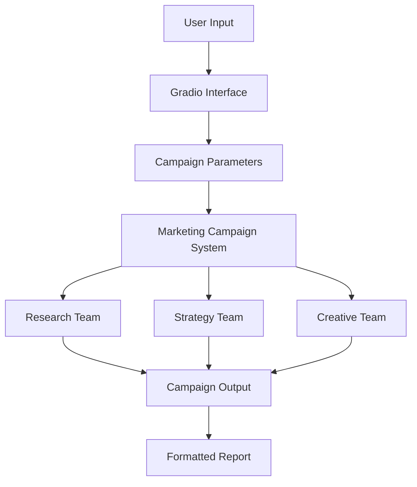

# Marketing Campaign Development System

## Overview

The Marketing Campaign Development System is a professional-grade AI-powered platform that automates and streamlines the creation of enterprise marketing campaigns. Using multiple AI agents organized into specialized teams, the system delivers comprehensive marketing strategies, creative concepts, and execution plans.

## Features

### 🤖 Multi-Agent Architecture
- **Research Team**
  - Senior Market Analyst
  - Audience Research Specialist
- **Strategy Team**
  - Chief Marketing Strategist
  - Campaign Budget Specialist
- **Creative Team**
  - Creative Content Director
  - Senior Creative Designer

### 🔄 Parallel Workflow Processing
- Concurrent execution of multiple agent tasks
- Efficient resource utilization
- Reduced campaign development time

### 🎯 Key Capabilities
- Market and competitor analysis
- Audience segmentation
- Campaign strategy development
- Budget optimization
- Creative concept generation
- Timeline planning
- KPI setting and tracking

### 💼 Enterprise Features
- Rate limiting and caching
- Asynchronous processing
- Error handling and recovery
- Performance monitoring
- Structured output formats

## Installation

```bash
# Clone the repository
git clone https://github.com/h9-tec/marketing-campaign-system.git

# Navigate to project directory
cd marketing-campaign-system

# Install required packages
pip install -r requirements.txt
```

## Configuration

1. Set up your OpenAI API key:
```bash
export OPENAI_API_KEY="your-api-key"
```

2. (Optional) Adjust the configuration in `marketing_campaign_system.py`:
```python
self.rate_limit = 1.0  # Modify API rate limit
cache_results = True    # Enable/disable caching
```

## Usage

### Running the Application

```bash
python marketing_campaign_system.py
```

### Using the Gradio Interface

1. Access the web interface at `http://localhost:7860`
2. Input campaign parameters:
   - Target Industry
   - Campaign Focus
   - Budget Range
   - Target Audience
   - Timeline
   - KPIs

### API Usage

```python
from marketing_campaign_system import MarketingCampaignSystem, CampaignParameters

# Initialize the system
system = MarketingCampaignSystem()

# Create campaign parameters
params = CampaignParameters(
    target_industry="Technology",
    campaign_focus="Product Launch",
    budget_range=100000,
    target_audience="Enterprise CTOs",
    timeline="6 months",
    kpis=["leads", "engagement_rate"]
)

# Execute campaign development
result = await system.execute_campaign(params)
```

## Output Structure

The system generates a comprehensive campaign report including:

```
├── Market Analysis
├── Strategy
├── Campaign Concepts
├── Creative Assets
├── Timeline
├── Budget Allocation
├── KPI Targets
└── Execution Metrics
    ├── Token Usage
    ├── Execution Time
    └── Cost Estimate
```

## System Architecture



## Performance Optimization

The system includes several optimizations:
- LRU caching for search results
- Rate limiting for API calls
- Parallel execution of agent tasks
- Asynchronous processing
- Result caching

## Error Handling

The system implements comprehensive error handling:
- API rate limit management
- Failed request recovery
- Input validation
- Output structure verification
- Exception logging

## Contributing

1. Fork the repository
2. Create your feature branch (`git checkout -b feature/AmazingFeature`)
3. Commit your changes (`git commit -m 'Add some AmazingFeature'`)
4. Push to the branch (`git push origin feature/AmazingFeature`)
5. Open a Pull Request

## Requirements

- Python 3.8+
- OpenAI API key
- Required packages:
  - praisonai[crewai,tools]
  - gradio
  - pydantic
  - duckduckgo_search
  - asyncio

## License

This project is licensed under the MIT License - see the [LICENSE](LICENSE) file for details.

## Acknowledgments

- OpenAI for the GPT models
- PraisonAI for the agent framework
- Gradio for the web interface


## Roadmap

- [ ] Add support for more industries
- [ ] Implement advanced analytics
- [ ] Add custom agent creation
- [ ] Enhance visualization options
- [ ] Add export functionality

## Authors

- Hesham Haroon - *Initial work* - [YourGithub](https://github.com/h9-tec)

